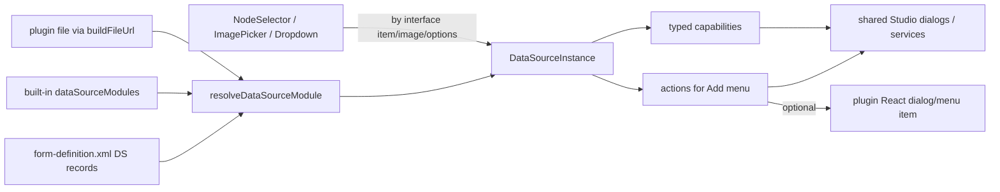

# FE2 Data Source Architecture

## Verdict

Legacy DS worked because **controls called behavior on DS instances**, not because DS were YUI classes. FE2 inverted that: controls/hooks switch on `ds.type` and own all flows. That is why plugins cannot plug in.

Your React-component idea is right for **custom action UI**, but wrong as the primary DS unit. Many DS are not “a field widget” — they are providers of list/browse/create/upload/edit. The best model is:

**Data Source = capability module + declarative actions (React when needed).**



## Why not the alternatives

- **Every DS is a mounted React control:** awkward for taxonomy/KVP (`getList` only), forces lifecycle/mounting for non-UI work, and recreates “control knows DS internals” unless you still invent capabilities.
- **Pure services with zero React:** cannot express plugin-specific pickers/menus without forever extending central control UI.
- **Keep consolidator switches:** cannot support unknown plugin types without Studio code changes.

Hybrid preserves the good FE2 work (`useExtractDataSources`, path macros, shared browse/search/upload dialogs in [`controlHelpers.tsx`](ui/app/src/components/FormsEngine/lib/controlHelpers.tsx)) while restoring the legacy virtue: **behavior lives with the DS**.

## FE2 audit refinements (keep / fix / reuse)

From the FE2 DS-layer audit:

**Keep as-is:** [`useExtractDataSources`](ui/app/src/components/FormsEngine/dataSourceHooks/useExtractDataSources.tsx) (generic id extraction). Control-facing bucket shapes (`AllowedPathsData`, create-type lookup) are already nearly capability-neutral — modules should *emit* those shapes via actions/results, not be interpreted by type switches.

**Cheapest existing capability hook:** TB already writes `DataSource.interface` (`item`/`image`/`video`/`audio`) into form-definition XML and filters DS pickers by it — but FE2 never reads `interface` at runtime. Capability matching should use that field (with empty/legacy fallbacks).

**Reuse, don’t rebuild:** `showBrowseFilesDialog` / `showSearchDialog` / `showSingleFileUploadDialog` / `showImageCropDialog` in [`controlHelpers.tsx`](ui/app/src/components/FormsEngine/lib/controlHelpers.tsx); `ContentPicker` + NodeSelector’s private create picker (promote/dedupe); `ControlWrapper`’s URL-keyed lazy import + error boundary as the DS plugin loader template; `useStableGlobalApiContext().pushForm` for create/edit.

**Host API gap:** plugin controls/DS cannot import internal hooks. Publish DS services/types (and dialog helpers) on the Studio host surface; today `FormsEngine/index.ts` exports almost nothing of this.

**Property-name reality:** keep per-control property names for now (`itemManager`, `imageManager`, `datasource`, and RTE’s `videoManager`/`audioManager`/`fileManager`) via the extract helper’s `dataSourceProperty` arg — normalization is a later migration, not Phase 0.

**FE2 coverage gaps / bugs to fold into implementation:**
- No `VideoPicker` yet (`controlMap` null) — video/audio modules can land before the control, but Phase 2 depends on control existence or RTE consumption.
- Image S3/WebDAV DS silently dropped; `configured-list` unsupported; Dropdown can crash on empty/`undefined` optionGroups; Dropdown reads DS from Redux catalog instead of passed `contentType` (breaks TB virtual types); extract filters discard field-reference order; dead `useExtractItemPickerDataSources.ts`; `useKVPLoader` leaks subscriptions / no error path; parse-time `repoPath` non-null assumption in `getFieldDataSourceValidations`.

**`dataSourceMap.ts` note:** typed as `Record<string, ElementType>` — historical “DS as React component” stub. Replace with a **module** registry (`DataSourceModule`), not `ElementType`; optional React stays on actions (`MenuItem`/`Dialog`) only.

## Legacy audit refinements (fold into contract)

From the full 28-file legacy audit:

**True runtime surface used by controls is tiny:** `add`, `edit`, `updateItem`, `getList`, `getDataType`, `insertImageAction` / `insertVideoAction` / `insertAudioAction`, plus flags `itemsAreContentReferences`, `flattened`, `selectItemsCount`. Everything else (`getName`/`getLabel`/`getSupportedProperties`, etc.) is design-time/TB.

**Do not port accidentally DS-owned behavior.** Move to control/framework:

- Menu DOM construction and “single action → fire directly” UX
- Remaining multi-select capacity math (stop mutating `ds.selectItemsCount`)
- Preselected-path derivation from current field value
- Permission/edit-vs-view resolution (dedupe repeated sandbox lookups)
- Asset extension/dimension validation and cropper orchestration (already mostly control-side in FE2)
- Value serialization (`include` / `inline` / fileType postfix variants)

**Genuinely DS-owned:** paths/profiles/allowed types; which actions are enabled; how a pick maps to a stored reference/path/URL; shared vs embedded create/edit strategy; option-list sourcing; content-reference semantics.

**Drop / normalize as dead or broken in FE1:** `flash` interface (no consumer), empty `edit` stubs that create phantom Edit buttons, `getConfig`, `deleteImage`/`deleteVideo`, `constraints` constructor arg never passed, `key-value-list` `eval`, NodeSelector-missing `failure` calls. Fold `transcoded-video` into `video` with a variants/multi-URL result shape. Include `configured-list` in the options family (legacy exists; FE2 consolidators currently miss it along with S3/WebDAV).

**Also a consumer:** legacy RTE resolves media DS by interface and calls insert*Action / synthetic `add` — FE2 redesign should keep RTE/media-manager needs in mind even if Phase 1 focuses on NodeSelector/ImagePicker.

## Target contract

### 1. Module + instance

```ts
type DataSourceInterface = 'item' | 'image' | 'video' | 'audio' | 'options';
// 'options' replaces overloaded legacy getInterface:'item' for KVP/taxonomy/configured-list
// legacy 'transcoded-video' → video + variants; 'flash' dropped

interface DataSourceModule {
  type: string; // e.g. 'shared-content'
  interfaces: DataSourceInterface[];
  create(ctx: DataSourceCreateContext): DataSourceInstance;
}

interface DataSourceInstance {
  id: string;
  type: string;
  title: string;
  interfaces: DataSourceInterface[];
  // Declarative Add-menu contributions (replaces add / insert*Action menu building)
  getActions(ctx: FieldContext): DataSourceAction[];
  capabilities: {
    // Optional — presence means real support (no empty stubs)
    edit?: EditCapability; // Observable/Promise<EditResult>
    list?: ListCapability; // options family; includes dataType/showKeys via descriptor or result meta
    refreshItem?: RefreshItemCapability; // batched label refresh; replaces updateItem
  };
  flags?: {
    contentReference?: boolean; // was itemsAreContentReferences
    embedded?: boolean; // was flattened / inline embedding
  };
}

interface FieldContext {
  formModel: unknown;
  fieldId: string;
  currentValue: unknown;
  remainingCapacity: number; // -1 = unlimited
  multiSelect: boolean;
  readonly: boolean;
  // macros / item path context for processPathsForMacros at action time
}
```

`DataSourceCreateContext` receives the inert DS record (`id/type/title/interface/properties[/plugin]`), and **platform services** (browse/search/upload dialogs, content form push, S3/WebDAV helpers, path-macro expansion). DS modules call services; they do not reach into control DOM or append menu markup.

### 2. Actions replace legacy `add(control)` / `insertImageAction`

Legacy node-selector literally did `datasource.add(control)` and DS mutated the menu. Image/video called `insertImageAction` / `insertVideoAction`.

Modern equivalent — declarative actions the **control** renders:

```ts
interface DataSourceAction {
  id: string; // 'browse' | 'upload' | 'create-embedded' | custom
  label: ReactNode;
  icon?: ReactNode;
  kind: 'browse' | 'search' | 'upload' | 'create' | 'custom';
  run(ctx: FieldContext): Promise<DataSourceSelection[]>;
  // Optional custom UI for plugins that need more than shared dialogs:
  MenuItem?: ComponentType<DataSourceMenuItemProps>;
  Dialog?: ComponentType<DataSourceDialogProps>;
}

// Normalized pick results — control maps these into XML value shapes
type DataSourceSelection =
  | { kind: 'shared' | 'embedded' | 'remote'; path: string; label: string; fileType?: string; fileSize?: string }
  | { kind: 'asset'; relativeUrl: string; previewUrl?: string; fileName: string; fileExtension: string; remote?: boolean; external?: boolean; variants?: Array<{ url: string }> }
  | { kind: 'option'; key: string; label: string; value: string };
```

Controls become shell + selection state owners. They:

1. Resolve field DS ids (`itemManager` / `imageManager` / `datasource` / videoManager equivalents).
2. Instantiate modules.
3. Filter by required interface.
4. Collect `getActions(fieldContext)`, apply framework UX rules (disable when capacity 0; if exactly one action across all DS, fire directly).
5. Apply returned selections into control-specific value shape.
6. Delegate edit/refresh only when `capabilities.edit` / `refreshItem` are actually present.

No `switch (ds.type)` in controls.

### 3. Registry + loader (built-ins and plugins share one path)

Replace unused [`dataSourceMap.ts`](ui/app/src/components/FormsEngine/lib/dataSourceMap.ts) with a real module registry:

- Built-ins: static map `type → () => import('./dataSources/sharedContent')`.
- Plugins: if DS record has `plugin` coordinates, `buildFileUrl` + dynamic `import()` (same pattern as [`controlHelpers.tsx`](ui/app/src/components/FormsEngine/lib/controlHelpers.tsx) controls), expect `default` export = `DataSourceModule` (or `{ dataSource: DataSourceModule }`).
- Cache by URL/type; Suspense/error isolation at resolve time.
- FE1 YUI DS classes are **not** compatible; migration guide required (same stance as FE2 controls).

### 4. Control consumption API

Introduce something like:

```ts
useFieldDataSources(contentType, field, propertyName, requiredInterface);
// → { instances, actions, status, error }
```

Keep [`useExtractDataSources`](ui/app/src/components/FormsEngine/dataSourceHooks/useExtractDataSources.tsx) as the id-extraction step. Retire type-switch consolidators ([`useConsolidatedItemPickerData`](ui/app/src/components/FormsEngine/dataSourceHooks/useConsolidatedItemPickerData.ts), [`useConsolidatedImagePickerData`](ui/app/src/components/FormsEngine/dataSourceHooks/useConsolidatedImagePickerData.ts), [`useKVPLoader`](ui/app/src/components/FormsEngine/dataSourceHooks/useKVPLoader.ts)) once modules provide equivalent capabilities — or rewrite them as thin aggregators over actions/capabilities with **zero type switches**.

### 5. Capability mapping from legacy (must preserve)

- **Item family** (`components`, `pages`, `shared-content`, `embedded-content`, `file-*`, generic `S3-*` / `WebDAV-*`): interface `item`; actions create/browse/search/upload; optional `edit` / `refreshItem`; flags for content-reference vs embedded.
- **Media family** (`img-*`, `video-*`, `audio-*`): interfaces `image`/`video`/`audio`; actions browse/search/upload (and remote variants); asset selection shape including optional `variants` for transcoding.
- **Options family** (`key-value-list`, `simpleTaxonomy`, `configured-list`): interface `options` (compat: legacy stored `item` + list-only); `list` capability replaces `getList`/`getDataType`.

Also preserve: path macros evaluated **at action time** against form model; multi-select remaining capacity passed via `FieldContext` (not DS mutation); enable\* property gates as presence/absence of actions; remote/external result flags for preview URL handling.

### 6. Model / TB / XML round-trip (required companion work)

Without this, plugins still cannot survive TB → FE:

- Extend [`DataSource`](ui/app/src/models/ContentType.ts) with optional `plugin: { pluginId, type, name, filename }`.
- Teach [`convertDataSourceStructToXmlStruct`](ui/app/src/components/ContentTypeManagement/utils.ts) to serialize it (mirror field plugin handling).
- On TB insert in [`EditTypeView.tsx`](ui/app/src/components/ContentTypeManagement/components/EditTypeView.tsx), copy plugin coords from `ui.xml` catalog entry onto the new DS record.
- Keep TB **descriptors** separate (property forms) from FE **modules** (runtime behavior), linked by `type` (+ optional plugin locator).

### 7. What we keep from today’s FE2

- Field→DS id extraction and multi-DS fields.
- Shared dialog helpers / Redux dialog stack usage.
- Path macro processing and content-type aware create flows already in NodeSelector.
- Author UX of consolidating multiple DS into one Add menu (derived from actions, not type switches).

### 8. What we discard

- Hard-coded `switch (ds.type)` as the extension mechanism.
- Treating DS as inert config forever.
- Expecting FE1 `CStudioForms.Datasources.*` classes to run in FE2.
- Mounting every DS as a permanent React field sibling.
- Porting menu DOM mutation, shared mutable `selectItemsCount`, empty `edit` stubs, `flash` interface, and other dead FE1 surfaces listed above.

## Implementation phases

### Phase 0 — Contracts + platform skeleton

- Add types under `FormsEngine/dataSources/types.ts`.
- Add `DataSourceServices` façade wrapping existing browse/search/upload/form helpers.
- Add registry/loader/`useFieldDataSources` (match by `interface`, preserve field-reference order, support plugin URL load mirroring `ControlWrapper`).
- Decide host-export surface for plugin-safe access to services/helpers.
- Update living docs (`type-builder-forms-engine.md` + plugins companion).
- Fix cheap landmines that block migration: dead extract hook removal/merge; Dropdown DS source + empty-state crash; optional-chain `datasource` property.

### Phase 1 — Item family + NodeSelector

- Implement modules: `components`, `pages`, `shared-content`, `embedded-content`, `file-browse-repo`, `file-desktop-upload`.
- Refactor [`NodeSelector.tsx`](ui/app/src/components/FormsEngine/controls/NodeSelector.tsx) to collect `getActions(fieldContext)` and use `edit`/`refreshItem`.
- Promote/dedupe ContentPicker vs private DataSourcePicker; keep 1-vs-N execute-directly UX in the control/framework.
- Prove parity on editorial content types; delete item consolidator switch usage.

### Phase 2 — Image (+ Video/Audio as clones)

- Modules for img-repository/desktop/S3/WebDAV.
- Refactor [`ImagePicker.tsx`](ui/app/src/components/FormsEngine/controls/ImagePicker.tsx) off hard-coded browse|upload|search-only menu (addresses the TODO at ~L110).
- Mirror for video/audio pickers when those controls are active.

### Phase 3 — Options family

- `key-value-list`, `simpleTaxonomy` via `list` capability.
- Refactor Dropdown/CheckboxGroup to consume `options` interface.

### Phase 4 — Remote DS + plugins + TB wiring

- Remaining S3/WebDAV/file generic modules.
- Plugin load path + example module in authoring-ui-plugin-examples.
- DS plugin XML round-trip + TB insert propagation.
- Compatibility notes for FE1 packages.

## Success criteria

- Adding a new built-in or plugin DS requires **no edits** to NodeSelector/ImagePicker/Dropdown switches.
- A field with multiple DS shows a menu driven solely by declared actions.
- FE filters/matches DS by `interface` (not only by hard-coded type ids).
- Plugin DS with custom Dialog/MenuItem works end-to-end when coordinates exist in form-definition.
- Legacy editorial types keep create/browse/search/upload/edit behavior and content XML shapes.
- Image S3/WebDAV and `configured-list` work (or explicitly error) instead of failing silently.
- TB can attach and round-trip DS plugin metadata.
- Plugin authors can access the published DS services API without bundling Studio internals.

## Primary files

- New: `ui/app/src/components/FormsEngine/dataSources/**`
- Refactor: `dataSourceHooks/*`, `controls/NodeSelector.tsx`, `controls/ImagePicker.tsx`, `controls/Dropdown.tsx`, `controls/CheckboxGroup.tsx`
- Platform reuse: `lib/controlHelpers.tsx`, `services/plugin.ts`
- Model/TB: `models/ContentType.ts`, `ContentTypeManagement/utils.ts`, `EditTypeView.tsx`
- Docs: `docs/type-builder-forms-engine.md`, `docs/type-builder-forms-engine-plugins.md`
- Legacy reference: `static-assets/components/cstudio-forms/data-sources/*`, `controls/node-selector.js`, `image-picker.js`, `dropdown.js`
